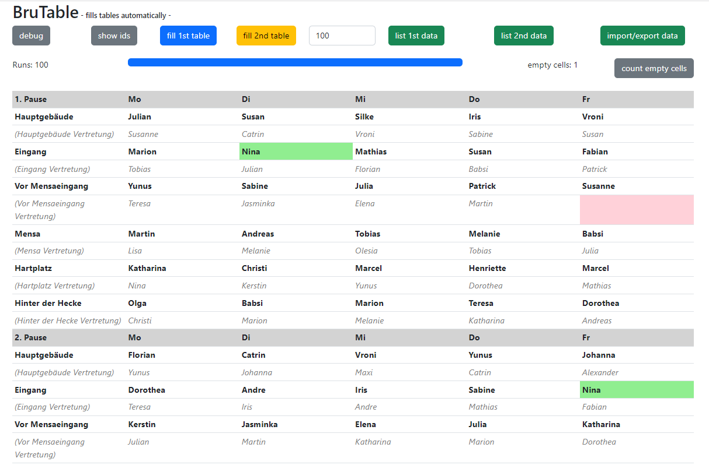

# BruTable

## start
- `npm install`
- `npm start`

## info
Automatically tries to populate a table with teachers to create a break schedule.



## data
Uses data to create the fill rules:

```javascript
//Teacher data
let TEST_PERSON_DATA = [ 
  { name: "Silke ", noOptions: [].concat(DIENSTAG_1, MITTWOCH_3, DONNERSTAG_3), onlyOptions: [].concat(), jokerOptions: [], count: 0, maxCount: 2, days: [], maxPerDay: 1, hauptpause: false },
  { name: "Jasminka ", noOptions: [].concat(MITTWOCH_2, MITTWOCH_3, DIENSTAG_3), onlyOptions: [].concat(), jokerOptions: [], count: 0, maxCount: 2, days: [], maxPerDay: 1, hauptpause: false },
  ...

```
### breaks and days data
```javascript
let HAUPTPAUSE_BEACHTEN = true;
let PAUSENZEIT_1 = ["0", "1", "2", "3", "4", "5", "6", "7", "8", "9", "10", "11"];
let PAUSENZEIT_2 ...

let DAY_TO_CELL_MAP = {
  //1. Pause
  Mo1: "0_1",
  Mo2: "2_1",
  Mo3: "4_1",
  Mo4: "6_1",
  ...
}

//break data, there are three breaks each day but friday
let MONTAG_1 = ["Mo1", "Mo2", "Mo3", "Mo4", "Mo5", "Mo6"];
let MONTAG_2 = ["Mo7", "Mo8", "Mo9", "Mo10", "Mo11", "Mo12"];
...

```

### table data
```javascript
let TABLE_DATA = {
  rows: [
    /////////////////////////// 1. Pause ///////////////////////////
    { values: ["1. Pause", "Mo", "Di", "Mi", "Do", "Fr"], type: "header", style: "cellBold" },

    { values: ["Hauptgebäude", "", "", "", "", ""], type: "cell", style: "" },
    { values: ["(Hauptgebäude Vertretung)", "", "", "", "", ""], type: "vert", style: "cellGrey" },

    { values: ["Eingang", "", "", "", "", ""], type: "cell", style: "" },
    { values: ["(Eingang Vertretung)", "", "", "", "", ""], type: "vert", style: "cellGrey" },

    { values: ["Vor Mensaeingang", "", "", "", "", ""], type: "cell", style: "" },
    { values: ["(Vor Mensaeingang Vertretung)", "", "", "", "", ""], type: "vert", style: "cellGrey" },
    ...
 ]
}
```